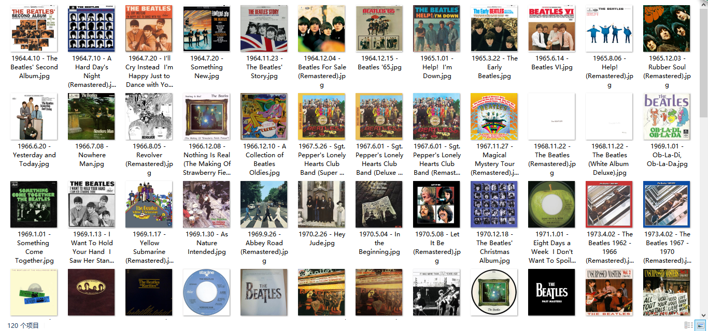
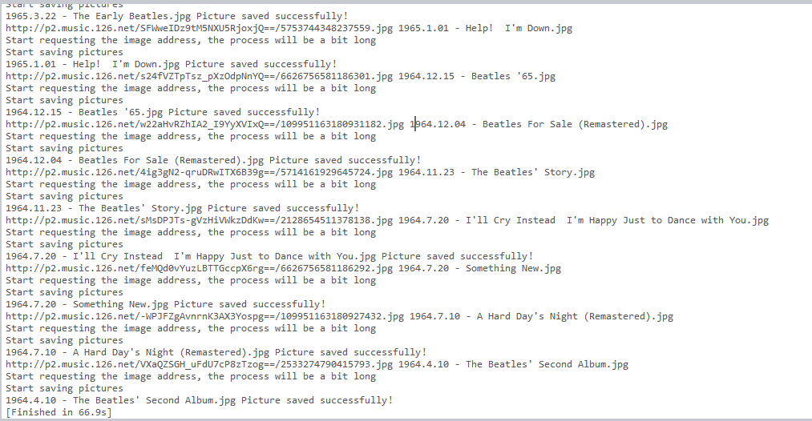

# Crawl-album-cover
Project Overview: Catch the album cover of TheBeatles Netease Cloud Music  

Use packages: selenium, BeautifulSoup, requests  

Crawl process:   

&emsp;&emsp;&emsp;1) Connect to Chrome using selenium .webdriver, request url  

&emsp;&emsp;&emsp;2) Connect to the iframe of the web page and get html  

&emsp;&emsp;&emsp;3) Analyze html using BeautifulSoup  

&emsp;&emsp;&emsp;4) Save the picture and name it according to the information about the album  

Result: Climbing 120 pictures and naming it takes about 66.9s

项目概述:捕捉披头士网易云音乐专辑封面

使用包:selenium, BeautifulSoup, requests

爬行过程:

&emsp;&emsp;&emsp;1) 使用selenium.webdriver连接到Chrome，请求url

&emsp;&emsp;&emsp;2)连接到网页的iframe，获取html

&emsp;&emsp;&emsp;3)使用BeautifulSoup分析html

&emsp;&emsp;&emsp;4)保存图片，并根据相册信息命名

结果:爬图120张，命名耗时约66.9秒
  
  
  
  
